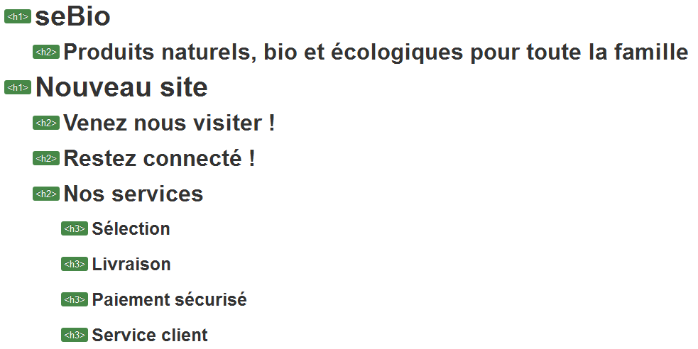
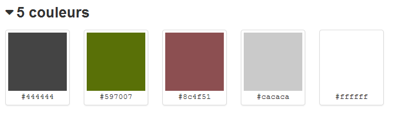

# CSS "Sebio"

> CSS exercise given at HEPL

* * *

**CSS "Sebio"** is an educational project, which will be used for `HTML`/`CSS` courses.

**Note:** the school where the course is given, the [HEPL](http://www.provincedeliege.be/hauteecole) from Liège, Belgium, is a french-speaking school. From this point, the instruction will be in french. Sorry.

* * *

> Lors de vos labos de *travaux dirigés*, vous allez découvrir le langage CSS et le mettre en pratique via de courts exercices de mise en situation.  
> Les labos de *travaux pratiques* vont vous confronter à des exercices pratiques et individuels reprenant la matière vue lors des TDs précédents.

* * *

## SeBio

Vous trouverez dans ce dossier un fichier texte nommé **sebio.txt**. Ce fichier contient le texte d’une *newsletter* qui annonce la sortie du nouveau site de Sebio, un *e-commerce* qui vend des produits naturels et bio. 

Votre mission est double&nbsp;:

1. créer le fichier HTML dans lequel vous baliserez le contenu de `sebio.txt`&nbsp;;
2. créer la feuille de style qui donnera à cette page le rendu suivant&nbsp;:

### Consignes

#### Fichier HTML

* Sur base du fichier `sebio.txt` et des images fournis (N.B. les images banniere.png et *.gif sont considérées comme décoratives et doievnt donc être intégrées via CSS), générez le fichier `index.html` dans lequel vous balisez le contenu de la manière la plus sémantique possible en respectant toutes les bonnes pratiques vues au cours de *Création de pages Web - HTML*&nbsp;;
* Les grandes sections doivent être organisées commme suit et posséder les ID et les classes reprises dans le rendu ci-dessous&nbsp;:

* Le plan de votre document doit être celui-ci&nbsp;:

#### Fichier CSS

* Sur base du rendu fourni et du fichier `index.html`, compléter le fichier `css/styles.css`
* Les couleurs que vous devez employer sont reprises ci-dessous&nbsp;:

* Le but de l’exercice est de pratiquer les bases et d’utiliser les propriétés de **background** ainsi que la technique de **remplacement de texte par une image**.

* * *

Code original par [Myriam Dupont](https://github.com/myriamdupont).
